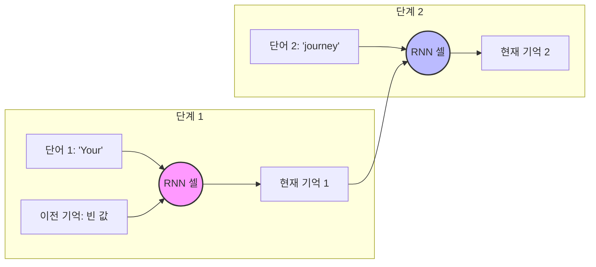
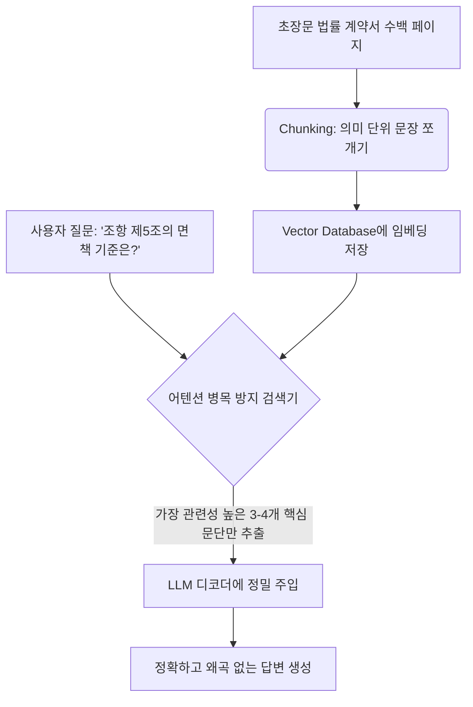

## 2. 3.1 The problem with modeling long sequences 완벽 해부

### (1) 단어 대 단어(1:1) 번역의 한계와 문맥 정렬의 필요성

- **교재의 문장 연결:** 저자는 3.1절 첫머리에서 다음과 같이 화두를 던집니다.
    
    > *"Suppose we want to develop a language translation model that translates text from one language into another. As shown in figure 3.3, we can’t simply translate a text word by word due to the grammatical structures in the source and target language."*
    > 
    > 
    > (우리가 한 언어에서 다른 언어로 텍스트를 번역하는 언어 번역 모델을 개발하고 싶다고 가정해 봅시다. 그림 3.3에서 볼 수 있듯이, 소스 언어와 타겟 언어의 문법 구조가 다르기 때문에 단순히 단어 대 단어로 텍스트를 번역할 수는 없습니다.)
    > 
- **처음부터 풀어쓰는 개념 설명:**
    
    컴퓨터에게 번역을 시킨다고 생각해 봅시다. 가장 원초적인 접근법은 영-한 사전을 컴퓨터에 통째로 집어넣고 단어가 나올 때마다 1:1로 치환하는 것입니다.
    
    하지만 언어는 저마다 고유한 문법적 규칙과 어순(Grammatical Structures)을 가집니다. 예를 들어, 영어는 "주어 + 동사 + 목적어" 순서이지만, 한국어는 "주어 + 목적어 + 동사" 순서입니다. 단어를 순서대로만 바꾸면 완전히 깨진 문장이 나옵니다. 즉, 인공지능이 번역이나 글쓰기를 잘하려면 문장 전체를 아우르는 문맥적 이해(Contextual Understanding)와 문장 구조를 재배치하는 **문법적 정렬(Grammatical Alignment)** 능력이 필수적입니다.
    
- **[교재 그림 해설] Figure 3.3 분석:**


- **책의 시각 자료 설명:** 본문의 **Figure 3.3**은 독일어 입력 문장 *"Kannst du mir helfen diesen Satz zu uebersetzen"*를 영어로 번역하는 과정을 보여줍니다.
- 이 그림에서 단어를 위에서 아래로 곧바로 1:1 매칭하여 번역하면 영어 문장의 어순이 엉망진창이 되며, 하단에 "The word-by-word translation results in a grammatically incorrect sentence" (단어 대 단어 번역은 문법적으로 틀린 문장을 초래한다)라는 경고 문구가 화살표와 함께 표시되어 있습니다. 즉, 전체 맥락을 보지 않고 눈앞의 단어만 보면 번역이 실패한다는 것을 시각적으로 증명하는 그림입니다.

---

### (2) 딥러닝의 고전적 해결책: 인코더-디코더(Encoder-Decoder) 구조

- **교재의 문장 연결:** 단어 1:1 매칭의 한계를 극복하기 위해 신경망 연구자들이 도입한 표준 아키텍처를 저자는 이렇게 설명합니다.
    
    > *"To address this problem, it is common to use a deep neural network with two submodules, an encoder and a decoder. The job of the encoder is to first read in and process the entire text, and the decoder then produces the translated text."*
    > 
    > 
    > (이 문제를 해결하기 위해, 인코더와 디코더라는 두 개의 서브 모듈을 가진 심층 신경망을 사용하는 것이 일반적입니다. 인코더의 역할은 먼저 전체 텍스트를 읽고 처리하는 것이며, 디코더는 그 후에 번역된 텍스트를 생성합니다.)
    > 
- **처음부터 풀어쓰는 개념 설명:**
    
    인간 번역가의 행동을 뇌과학적으로 모방한 시스템입니다. 능숙한 번역가는 문장을 읽을 때 첫 단어만 보고 바로 입을 열지 않습니다. 원문 문장을 끝까지 다 읽고, 머릿속에서 그 의미를 완전히 소화한 뒤, 타겟 언어로 문장을 새로 작성합니다.
    
    - **인코더(Encoder):** 입력받은 원문(예: 한국어 문장)을 처음부터 끝까지 집중해서 읽고, 그 의미를 컴퓨터가 이해할 수 있는 하나의 거대한 '압축된 정보 덩어리(숫자 벡터)'로 변환하는 역할을 합니다. 정보를 안으로(In) 집어넣어 코드화(Code)한다고 해서 인코더입니다.
    - **디코더(Decoder):** 인코더가 만들어준 그 압축 정보 덩어리를 넘겨받아, 이를 바탕으로 목적 언어(예: 영어)의 단어를 첫 단어부터 차근차근 풀어내며 문장을 생성합니다. 암호를 풀듯이 정보를 해독(Decode)해 밖으로(Out) 내보낸다고 해서 디코더입니다.

---

### (3) 트랜스포머 이전의 지배자: 순환 신경망(RNN)의 작동 원리

- **교재의 문장 연결:** 저자는 트랜스포머와 LLM이 등장하기 직전, 시퀀스 데이터를 처리하던 대표 주자인 RNN을 소개합니다.
    
    > *"Before the advent of transformers, recurrent neural networks (RNNs) were the most popular encoder–decoder architecture for language translation. An RNN is a type of neural network where outputs from previous steps are fed as inputs to the current step, making them well-suited for sequential data like text."*
    > 
    > 
    > (트랜스포머가 출현하기 전에는 순환 신경망(RNN)이 언어 번역을 위한 가장 인기 있는 인코더-디코더 아키텍처였습니다. RNN은 이전 단계의 출력이 현재 단계의 입력으로 공급되는 신경망 유형으로, 텍스트와 같은 순차 데이터에 매우 잘 맞습니다.)
    > 
- **처음부터 풀어쓰는 개념 설명:**
    
    텍스트는 시간의 흐름이나 순서가 있는 시퀀스 데이터(Sequential Data)입니다. "사과가 맛있다"와 "맛있다 사과가"는 느낌이 다르고, 단어의 순서가 의미를 결정합니다. 일반적인 신경망은 모든 데이터를 한 번에 독립적으로 처리하기 때문에 이 '순서'의 개념을 모릅니다.
    
    반면 RNN(Recurrent Neural Network)은 '기억력'을 가진 신경망입니다. 톱니바퀴처럼 루프(순환) 구조를 가지고 있어서, 첫 번째 단어를 읽고 발생한 내부의 기억을 두 번째 단어를 읽을 때 전달하고, 그 결합된 기억을 다시 세 번째 단어로 전달합니다.
    



---

### (4) RNN 인코더-디코더의 정보 압축 과정과 은닉 상태(Hidden State)

- **교재의 문장 연결:** 이제 저자는 RNN이 인코더-디코더 구조 속에서 구체적으로 어떻게 정보를 축적하고 넘겨주는지 파고듭니다.
    
    > *"In an encoder–decoder RNN, the input text is fed into the encoder, which processes it sequentially. The encoder updates its hidden state (the internal values at the hidden layers) at each step, trying to capture the entire meaning of the input sentence in the final hidden state, as illustrated in figure 3.4. The decoder then takes this final hidden state to start generating the translated sentence, one word at a time."*
    > 
    > 
    > (인코더-디코더 RNN에서 입력 텍스트는 인코더로 들어가 순차적으로 처리됩니다. 인코더는 각 단계마다 자신의 은닉 상태(은닉층의 내부 값들)를 업데이트하며, 입력 문장의 전체 의미를 최후의 은닉 상태에 포착하려고 시도합니다(그림 3.4 참고). 그 후 디코더가 이 최종 은닉 상태를 받아 번역된 문장을 한 번에 한 단어씩 생성하기 시작합니다.)
    > 
- **처음부터 풀어쓰는 개념 설명:**
    
    여기서 가장 중요한 핵심 키워드는 은닉 상태(Hidden State)입니다. 쉽게 말해 인공지능의 **'메모리 플래시 드라이브(USB)'** 또는 '머릿속 생각 노트'라고 보시면 됩니다.
    
    인코더 RNN은 문장의 단어를 하나씩 읽을 때마다 이 은닉 상태라는 벡터(숫자 배열)의 값을 계속 지우고 새로 쓰면서 업데이트합니다. 문장의 마지막 단어까지 다 읽고 나면, 그 최종 은닉 상태(Final Hidden State) 벡터 안에는 문장 전체의 핵심 에센스가 압축되어 들어가 있을 것이라고 기대하는 것입니다. 저자는 이 최종 은닉 상태가 우리가 2장에서 배웠던 단어의 의미를 담은 임베딩 벡터(Embedding Vector)와 본질적으로 똑같은 개념이라고 친절하게 덧붙여 설명합니다.
    
- **[교재 그림 해설] Figure 3.4 분석:**

!image.png

- **책의 시각 자료 설명:** 본문의 **Figure 3.4**는 RNN 기반 인코더-디코더의 전체 작동 메커니즘을 흐름도로 시각화한 것입니다.
- 그림의 왼쪽(인코더)에서는 소스 언어 토큰들이 차례대로 입력되면서 내부 레이어(Hidden State)가 화살표를 타고 오른쪽으로 계속 전진하며 압축됩니다. 마침내 인코더의 맨 끝단에 도달하면, 모든 정보가 단 하나의 최종 은닉 상태로 꽉 짜여 응축됩니다.
- 그림의 오른쪽(디코더)은 이 오직 하나의 최종 은닉 상태 바틀넥(병목) 지점부터 시작하여 화살표를 받아 가며 타겟 언어 토큰을 하나씩 뱉어냅니다. 이 그림은 정보가 이동하는 통로가 매우 좁다는 점을 직관적으로 보여줍니다.

---

### (5) 치명적인 한계점: 정보의 병목 현상과 장기 의존성 문제 (Core Deficiency)

- **교재의 문장 연결:** 저자는 3.1절의 가장 핵심적인 결론이자, 왜 우리가 RNN을 버리고 어텐션과 트랜스포머를 배워야 하는지 그 치명적인 이유를 선언합니다.
    
    > *"The big limitation of encoder–decoder RNNs is that the RNN can’t directly access earlier hidden states from the encoder during the decoding phase. Consequently, it relies solely on the current hidden state, which encapsulates all relevant information. This can lead to a loss of context, especially in complex sentences where dependencies might span long distances."*
    > 
    > 
    > (인코더-디코더 RNN의 거대한 한계점은 디코딩 단계 동안 인코더의 이전 은닉 상태들에 직접 접근할 수 없다는 것입니다. 결과적으로 디코더는 모든 관련 정보가 응축되어 있다고 간주되는 '오직 현재의 은닉 상태'에만 전적으로 의존해야 합니다. 이는 특히 의존 관계가 먼 거리로 뻗어 있는 복잡한 문장에서 문맥의 손실(Loss of Context)을 초래할 수 있습니다.)
    > 
- **처음부터 풀어쓰는 개념 설명:**
    
    여기에 아주 심각한 아키텍처적 결함이 있습니다. 100개의 단어로 이루어진 아주 긴 논문 패러그래프를 번역한다고 생각해 봅시다. RNN 인코더는 1번째 단어부터 100번째 단어까지 읽으면서 은닉 상태 벡터를 계속 업데이트합니다.
    
    수학적으로, 새로운 정보가 계속 곱해지고 더해지면 **과거의 정보는 점점 희석되고 소실**됩니다. 이를 딥러닝에서는 **기디 현상(Gradient Vanishing)** 혹은 장기 의존성 문제(Long-Range Dependencies Problem)라고 부릅니다. 100번째 단어쯤 가면 1번째, 2번째 단어의 구체적인 뉘앙스는 기억 속에서 거의 지워지고 희미한 흔적만 남게 됩니다.
    
    더 심각한 것은 디코더의 태도입니다. 디코더는 문장을 생성할 때, 인코더가 단어들을 읽으며 거쳐 왔던 수많은 중간 생각들(중간 은닉 상태들)에는 전혀 접근할 수 없습니다. 오직 인코더가 최종적으로 건네준 **단 하나의 최종 은닉 상태 벡터**만 바라보고 모든 문장을 만들어야 합니다. 책 50페이지짜리 내용을 단 한 줄로 요약한 메모만 보고 원래 책 내용 전체를 복원해내라는 것과 같습니다. 이로 인해 문장이 조금만 길어져도 뒤로 갈수록 헛소리를 하거나 문맥을 완전히 놓쳐버리는 **정보의 병목(Bottleneck) 현상**이 발생합니다.
    

```
[입력 문장 전체] ----> [RNN 인코더] ----> [단 하나의 최종 은닉 상태 벡터 (병목 발생)] ----> [디코더]
                                                    ^
                                      앞부분 단어들의 세부 정보가 다 날아감!
```

---

## 3. 2026~2027년 최신 트렌드 반영: 실무에서의 맥락 확장과 아키텍처적 응용

교재 3.1절은 2014년~2017년 초창기 딥러닝 연구(Bahdanau Attention 등)의 한계를 짚고 있지만, 생성형 AI 엔지니어링 실무 환경(2026~2027년 기준)에서는 이 "Long Sequence Modeling Problem(긴 시퀀스 모델링 문제)"이 전혀 다른 차원으로 진화하여 다루어지고 있습니다. 실무적 관점에서 이 개념이 어떻게 연결되는지 알기 쉽게 풀어 설명해 드리겠습니다.

### (1) 1M~10M 초장문 컨텍스트(Long-Context) 시대의 실무적 직면 과제

과거에는 단 1,000개의 단어(토큰)만 넘어가도 인공지능이 쩔쩔맸지만, 최신 모델들은 수백만 토큰의 컨텍스트 윈도우를 제공합니다. 그러나 아키텍처 내부에서는 여전히 3.1절에서 지적한 "어떻게 하면 먼 거리에 있는 정보 간의 연관성을 잃지 않고 효율적으로 계산할 것인가?"의 문제를 해결하기 위해 고군분투하고 있습니다.

- **실무적 문제 (Needle in a Haystack - 건더기 찾기 테스트):**
    
    수만 페이지의 기업 매뉴얼 PDF를 LLM에 업로드하고 아주 구석에 있는 사소한 정보 하나를 질문했을 때, 모델이 그 정보를 완벽하게 찾아내어 답변할 수 있는지를 평가하는 테스트가 실무에서 매우 중요합니다. 3.1절의 원리처럼 앞부분 정보의 기억이 희석되면 이 테스트를 통과할 수 없습니다.
    

### (2) 최신 아키텍처 트렌드로의 확장 (Transformer vs Linear Attention / State Space Models)

현재 실무에서는 단순 셀프 어텐션이 가진 연산 비용(문장 길이가 길어질수록 연산량이 제곱($O(T^2)$)으로 폭증하는 문제)을 해결하기 위해, 3.1절에서 언급한 RNN의 '고정된 메모리 크기' 장점과 어텐션의 '모든 곳을 동시에 보는' 장점을 하이브리드한 신규 아키텍처들이 대거 도입되고 있습니다.

- **Mamba / SSM (State Space Models):** RNN처럼 연산량은 문장 길이에 비례해 선형적으로만 증가하면서도, 은닉 상태(Hidden State)의 압축 능력을 수학적으로 정밀하게 극대화하여 3.1절이 지적한 '문맥 손실 한계'를 돌파한 모델들입니다.
- **Linear Attention & FlashAttention-3:** 셀프 어텐션 메커니즘을 유지하되 하드웨어 가속기(GPU/NPU)의 메모리 계층 구조를 극한으로 활용하여 수십만 자의 문장도 병목 없이 초고속으로 처리하는 기술이 엔지니어링 실무 표준으로 정착해 있습니다.

### (3) 엔지니어링 실무 활용 예시: 엔터프라이즈 RAG(검색 증강 생성) 시스템 구축

기업용 금융/법률 AI 에이전트를 개발할 때, 수백 페이지의 계약서 파일들을 다루어야 합니다. 이때 3.1절의 '긴 시퀀스 컨텍스트 손실'을 방지하기 위해 실무에서는 다음과 같은 파이프라인을 설계합니다.

코드 스니펫



- **구체적 실무 예시:**
    
    아무리 최신 LLM이라 하더라도 책 수십 권 분량의 원문을 날것 그대로 집어넣으면, 문장의 중심을 잃고 3.1절의 RNN 바틀넥과 유사한 '컨텍스트 오염 및 환각(Hallucination)' 현상이 일어납니다.
    
    이를 방지하기 위해 엔지니어들은 문서를 수백 토큰 단위로 정밀하게 쪼개어(**Chunking**), 가장 핵심적인 부분만 어텐션 메커니즘이 집중해서 읽을 수 있도록 조율하는 **RAG(Retrieval-Augmented Generation)** 인프라를 구축하는 데 본 개념을 적극적으로 응용하고 있습니다.
    

---

## 4. 요약 및 학습 가이드

3.1절 내용을 완벽히 이해하셨다면, 다음 단계로 나아갈 준비가 되신 것입니다. 요약하자면 다음과 같습니다.

- 단어 대 단어 번역은 어순 차이 때문에 불가능하므로 문장 전체를 보는 눈이 필요합니다. (**Figure 3.3**)
- 과거 AI(RNN 인코더-디코더)는 문장 전체를 단 하나의 고정된 크기의 '은닉 상태(Hidden State)' 벡터로 억지로 압축했습니다. (**Figure 3.4**)
- 그 결과, 문장이 조금만 길어져도 앞부분 정보를 다 까먹고 디코더에 정보가 제대로 전달되지 않는 **치명적인 장기 의존성 병목 문제**를 겪었습니다.
- 이 한계를 극복하기 위해, 다음 절(3.2절)부터는 디코더가 최종 벡터뿐만 아니라 인코더의 **모든 중간 과정 단어들을 원할 때마다 직접 선택해서 들여다볼 수 있게 만드는 대혁신**, 즉 어텐션 메커니즘(Attention Mechanism)을 설계하게 됩니다.

책의 구체적인 문장과 그림 매칭 정보를 바탕으로 차근차근 코딩 파트로 진입하시면, 훨씬 입체적이고 깊이 있는 학습이 가능할 것입니다.
