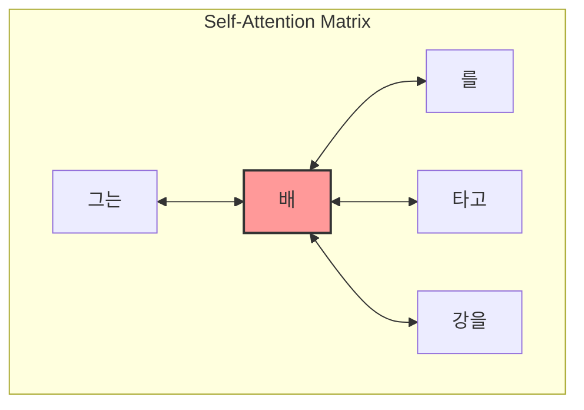
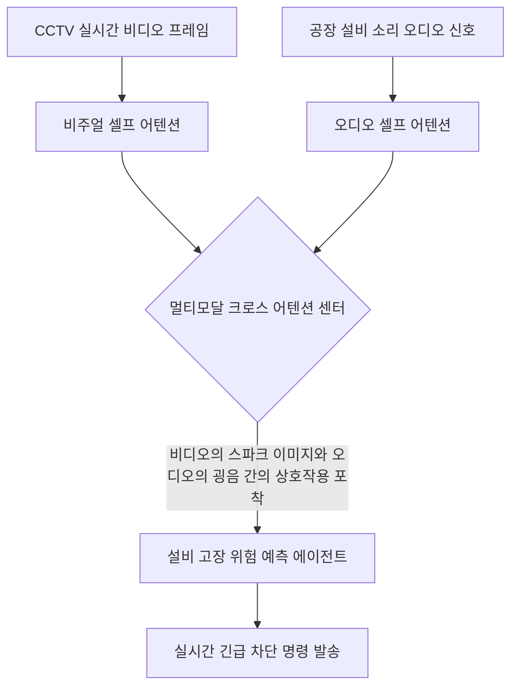

## 3.2 Capturing data dependencies with attention mechanisms 완벽 분석

### (1) Bahdanau 어텐션의 등장 배경과 작동 원리

- **교재의 문장 연결:** 저자는 3.2절 첫 단락에서 3.1절의 결론을 이어받으며 다음과 같이 설명합니다.
    
    > *"Although RNNs work fine for translating short sentences, they don’t work well for longer texts as they don’t have direct access to previous words in the input. One major shortcoming in this approach is that the RNN must remember the entire encoded input in a single hidden state before passing it to the decoder (figure 3.4)."*
    > 
    > 
    > (RNN은 짧은 문장을 번역할 때는 잘 작동하지만, 입력된 이전 단어들에 직접 접근할 수 없기 때문에 긴 텍스트에서는 잘 작동하지 않습니다. 이 접근법의 한 가지 주요 단점은 RNN이 인코딩된 입력 전체를 디코더에 전달하기 전에 '단 하나의 은닉 상태'에 기억해야만 한다는 점입니다.)
    > 
    
    이어서 2014년에 일어난 돌파구를 이렇게 연결합니다.
    
    > *"Hence, researchers developed the Bahdanau attention mechanism for RNNs in 2014... which modifies the encoder–decoder RNN such that the decoder can selectively access different parts of the input sequence at each decoding step as illustrated in figure 3.5."*
    > 
    > 
    > (따라서 연구진은 2014년에 RNN을 위한 바다나우(Bahdanau) 어텐션 메커니즘을 개발했습니다... 이는 디코더가 각 디코딩 단계에서 입력 시퀀스의 서로 다른 부분에 '선택적으로 접근(Selectively Access)'할 수 있도록 인코더-디코더 RNN을 수정합니다.)
    > 
- **개념 설명:**
    
    과거의 인공지능(고전 RNN)은 문장이 100단어이든 1,000단어이든 무조건 뇌의 한구석(최종 은닉 상태 벡터 하나)에 꾹꾹 눌러 담은 뒤 번역을 시작해야 했습니다. 당연히 정보가 다 깨지고 앞부분은 까먹게 됩니다.
    
    2014년 디미트리 바다나우(Dmitry Bahdanau) 연구원이 제안한 해결책은 간단하면서도 혁명적이었습니다. "디코더가 다음 단어를 번역해서 내뱉을 때마다, 인코더가 거쳐 왔던 모든 단어들의 발자취(모든 중간 은닉 상태들)를 자유롭게 들여다볼 수 있는 통로를 열어주자!"는 것이었습니다.
    
    예를 들어 영어 문장 "I am learning AI"를 한국어로 번역하다가 "AI"라는 단어를 출력할 차례가 되면, 디코더는 인코더가 "AI"를 읽었던 시점의 상태를 훨씬 더 집중해서(더 높은 가중치를 두고) 쳐다봅니다. 정보를 하나의 벡터에 억지로 가두지 않고, 입력 시퀀스의 필요한 부분을 **선택적으로 조회**하는 검색 필터가 생긴 셈입니다.
    
- **[교재 그림 해설] Figure 3.5 분석:**

- **책의 시각 자료 설명:** 본문의 **Figure 3.5**는 어텐션 메커니즘을 장착한 네트워크의 개념도입니다. 텍스트를 생성하는 우측의 디코더가 좌측 인코더 영역에 있는 모든 입력 토큰에 여러 갈래의 화살표로 동시에 연결되어 있습니다.
- 그림 하단의 캡션 설명에 따르면, 이는 특정 출력 토큰을 생성할 때 입력 토큰 중 일부가 다른 토큰보다 더 중요하다는 것을 보여줍니다. 그리고 이 중요도의 크기는 어텐션 가중치(Attention Weights)에 의해 결정된다고 명시되어 있습니다. 즉, 고정된 벽을 허물고 모든 과거 기억과 직접 연결선을 연결한 그림입니다.

---

### (2) 트랜스포머(Transformer)와 셀프 어텐션(Self-Attention)으로의 진화

- **교재의 문장 연결:** 저자는 바다나우 어텐션에서 출발한 아이디어가 3년 후 어떻게 딥러닝 판도를 통째로 바꿨는지 문장을 이어 나갑니다.
    
    > *"Interestingly, only three years later, researchers found that RNN architectures are not required for building deep neural networks for natural language processing and proposed the original transformer architecture... including a self-attention mechanism inspired by the Bahdanau attention mechanism."*
    > 
    > 
    > (흥미롭게도 불과 3년 후, 연구자들은 자연어 처리를 위한 심층 신경망을 구축하는 데 RNN 아키텍처가 전혀 필요하지 않다는 사실을 발견하고... 바다나우 어텐션 메커니즘에서 영감을 받은 '셀프 어텐션(Self-Attention) 메커니즘'을 포함하는 독창적인 트랜스포머 아키텍처를 제안했습니다.)
    > 
- **개념 설명:**
    
    어텐션은 원래 RNN을 도와주는 서브 모듈, 즉 보조 장치에 불과했습니다. 그런데 2017년, 구글 연구진은 엄청난 발견을 합니다. **"생각해 보니 RNN이 단어를 하나씩 순서대로 읽느라 속도도 느리고 기억도 흐려지는 건데, 차라리 RNN을 아예 삭제해 버리고 어텐션 메커니즘만으로 네트워크를 도배하면 어떨까?"**
    
    이 선언이 바로 그 유명한 논문 *'Attention Is All You Need'*이며, 이때 탄생한 구조가 오늘날 모든 GPT와 LLM의 뼈대인 트랜스포머(Transformer)입니다.
    
    그리고 이 트랜스포머의 핵심 엔진이 바로 셀프 어텐션(Self-Attention, 자체 어텐션)입니다.
    

---

### (3) 셀프 어텐션(Self-Attention)의 정의와 가치

- **교재의 문장 연결:** 저자는 셀프 어텐션이 정확히 무엇을 하는 기능인지 명확한 정의를 내립니다.
    
    > *"Self-attention is a mechanism that allows each position in the input sequence to consider the relevancy of, or “attend to,” all other positions in the same sequence when computing the representation of a sequence."*
    > 
    > 
    > (셀프 어텐션은 시퀀스의 표현(Representation)을 계산할 때, 입력 시퀀스의 각 위치가 '동일한 시퀀스' 내의 모든 다른 위치와의 관련성을 고려하거나 주목(Attend to)할 수 있도록 하는 메커니즘입니다.)
    > 
- **개념 설명:**
    - **전통적인 어텐션:** '입력 문장(영어)'과 '출력 문장(한국어)'이라는 서로 다른 두 시퀀스 사이의 관계를 매칭했습니다.
    - **셀프 어텐션 (Self):** **오직 자기 자신으로만 이루어진 하나의 문장 안에서** 단어들끼리의 관계를 매칭합니다.
    
    왜 문장 내부에서 단어들끼리 서로를 바라봐야 할까요? 인간도 글을 읽을 때 단어의 의미를 주위 맥락 속에서 파악하기 때문입니다.
    
    예를 들어 "그는 **배**를 타고 강을 건넜다"라는 문장과 "그는 마트에서 먹는 **배**를 샀다"라는 문장이 있다면, 똑같은 '배'라는 단어이지만 주변에 배치된 '타고', '강' 또는 '마트', '먹는'이라는 다른 단어들과의 관계 속에서 비로소 정확한 의미가 확정됩니다. 셀프 어텐션은 문장 안의 모든 단어가 서로에게 화살표를 쏘아 보내며 "내가 지금 이 문장 안에서 너랑 얼마나 깊은 연관성이 있지?"를 수학적으로 계산하여 단어의 벡터 표현을 훨씬 더 풍부하고 명확하게 업그레이드해 주는 역할을 합니다.
    

- **[교재 그림 해설] Figure 3.6 분석:**

- **책의 시각 자료 설명:** 본문의 **Figure 3.6**은 트랜스포머 내부에서 셀프 어텐션이 어떻게 작동하는지 묘사합니다. 입력 행렬 $X$에서 출발하여 동일한 시퀀스 내부의 단어들이 서로 교차 상호작용(Interaction)하며 중요도를 가중치로 환산하는 구조를 보여줍니다.
- 이 그림은 다음 장(4장)에서 코딩할 GPT 아키텍처로 넘어가기 전, 이번 3장에서 완전히 정복해야 할 밑바닥 코딩의 대상이 바로 이 '자체 단어 상호작용 그리드'임을 직관적으로 알려줍니다.

---

## 3. 2026~2027년 최신 트렌드 반영: 실무에서의 맥락 확장과 아키텍처적 응용

교재 3.2절은 트랜스포머의 근본 원리인 셀프 어텐션을 다루고 있지만, 오늘날(2026~2027년 기준) 엔지니어링 실무 환경에서는 이 셀프 어텐션의 개념이 대규모 데이터 센터 인프라와 결합하여 고도로 최적화된 형태로 활용되고 있습니다.

### (1) 실무적 사용: FlashAttention-3 및 하드웨어 가속 최적화

셀프 어텐션은 모든 단어가 모든 단어를 바라보기 때문에 문장 길이($T$)의 제곱인 $O(T^2)$의 연산량과 메모리를 요구합니다. 실무에서 10만 토큰, 100만 토큰의 초장문 컨텍스트를 다룰 때 이 제곱 배율의 메모리 점유는 서버 다운을 유발하는 주원인입니다.

- **실무 솔루션:** 2026~2027년 현재 현업에서는 셀프 어텐션을 날것 그대로 파이토치로 짜기보다, GPU의 내부 메모리(SRAM) 계층을 효율적으로 활용해 중간 연산 행렬을 메모리에 올리지 않고 온칩에서 빠르게 계산해 내는 **FlashAttention-3**나 **FlashDecoding** 기술을 기본적으로 적용하여 서빙 인프라 비용을 수십 배 절감하고 있습니다.

### (2) 최신 아키텍처 트렌드: Ring Attention을 통한 무한 컨텍스트

수백만 단어의 책이나 동영상 전체를 입력받아 처리해야 하는 멀티모달 LLM 실무에서는 단 한 대의 GPU 메모리에 셀프 어텐션 매트릭스를 다 올릴 수 없습니다.

- **실무 기술:** 이를 해결하기 위해 여러 대의 GPU가 동그랗게 링(Ring) 형태로 통신망을 구축하고, 셀프 어텐션 연산에 필요한 단어 블록들을 옆 GPU로 돌려가며 분산 계산하는 **Ring Attention** 아키텍처가 최신 대규모 모델 학습 및 추론 실무의 핵심 트렌드로 정착해 있습니다.

### (3) 실무 응용 예시: 멀티모달 에이전트에서의 교차 의존성 포착

3.2절의 셀프 어텐션 개념은 단순히 텍스트 데이터에만 머무르지 않고 비디오, 오디오, 센서 데이터 등 서로 다른 데이터 소스 간의 의존성을 포착하는 데 전방위적으로 활용됩니다.

- **구체적 실무 예시:**
    
    스마트 팩토리의 이상 징후 감지 AI 에이전트를 개발한다고 가정해 봅시다. 시스템은 카메라 영상(비주얼)과 장비 소리(오디오)를 동시에 입력받습니다.
    
    3.2절의 어텐션 원리를 확장하여, 비디오 속 단어(픽셀 블록)들과 오디오 속 단어(주파수 조각)들이 서로의 연관성을 계산하도록 설계합니다. 장비 주위에 불꽃이 튀는 영상이 잡히는 순간(비주얼), 그 시점의 미세한 쇠 마찰음(오디오) 쪽으로 어텐션 가중치를 집중시켜 "단순 노이즈가 아닌 심각한 엔진 과열 사고"임을 실시간으로 정확하게 추론해 내는 핵심 인프라로 쓰이고 있습니다.
    

---

## 4. 요약 및 학습 가이드

3.2절의 핵심 패러다임을 한 줄로 정리하면 "고정된 하나의 기억 세포(RNN Hidden State)를 버리고, 문장 속 모든 단어가 서로를 다이렉트로 탐색하게 만드는 유연한 정보망(Self-Attention)의 구축"입니다.

- 디코더가 원문의 모든 부분을 필요에 따라 들여다보게 한 **Bahdanau Attention (Figure 3.5)**
- 이 아이디어를 극대화하여 RNN을 지우고 문장 내부 단어들의 상호작용 그리드를 완성한 **Self-Attention (Figure 3.6)**

이 개념적 당위성을 머릿속에 정확히 인지하신 상태에서, 다음 3.3절의 본격적인 파이토치 행렬 곱셉 수식과 코드 구현으로 진입하시면 수식의 의미가 한결 매끄럽고 명확하게 와닿을 것입니다.
