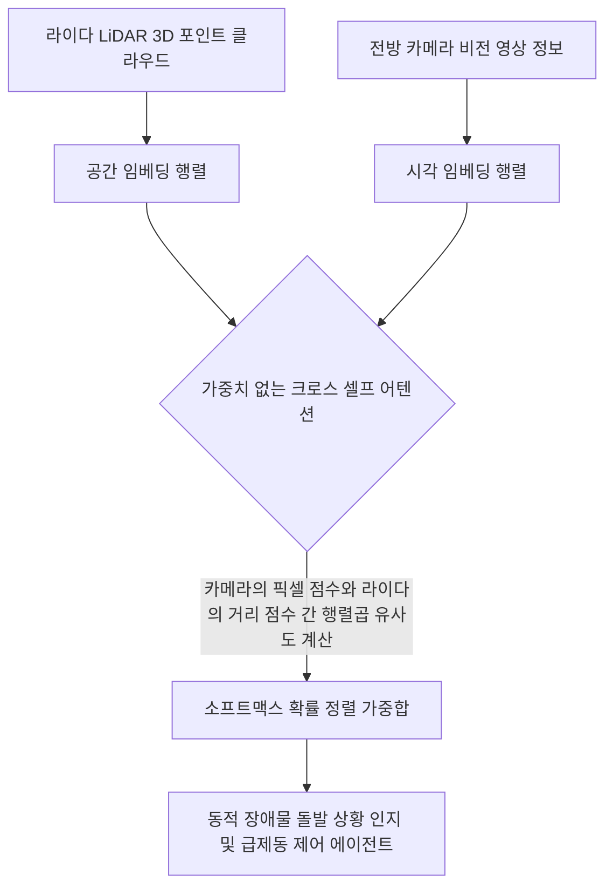

## 2. 3.3 Attending to different parts of the input with self-attention 완벽 분석

### (1) 셀프 어텐션에서의 "Self"의 의미와 전통적 어텐션과의 차이점

- **교재의 문장 연결:** 저자는 3.3절 도입부와 'THE “SELF” IN SELF-ATTENTION' 박스에서 다음과 같이 정의를 내립니다.
    
    > *"In self-attention, the “self” refers to the mechanism’s ability to compute attention weights by relating different positions within a single input sequence... This is in contrast to traditional attention mechanisms, where the focus is on the relationships between elements of two different sequences"*
    > 
    > 
    > (셀프 어텐션에서 "self"는 단일 입력 시퀀스 내의 서로 다른 위치들을 연결함으로써 어텐션 가중치를 계산하는 메커니즘의 능력을 의미합니다... 이는 어텐션이 입력 시퀀스와 출력 시퀀스라는 두 개의 서로 다른 시퀀스의 요소들 사이의 관계에 초점을 맞추었던 전통적인 어텐션 메커니즘과 대조적입니다.)
    > 
- **개념 설명:**
    
    인공지능이 "사과가 나무에서 떨어졌다"라는 문장을 읽을 때, '떨어졌다'라는 행동이 무엇과 연결되는지 알기 위해 다른 문장을 볼 필요가 없습니다. 바로 자기 자신으로만 이루어진 하나의 문장 내부(Single Input Sequence)를 보면 됩니다.
    
    과거의 바다나우 어텐션은 영어 문장(입력)과 한국어 문장(출력)이라는 전혀 다른 두 명의 대상을 매칭해주는 중매쟁이였다면, 셀프 어텐션은 하나의 문장 안에서 단어들끼리 서로 "너 나랑 얼마나 친해?"를 따지는 내부 사교 모임과 같습니다. 문장 안의 모든 단어가 서로에게 화살표를 쏘아 보내며 관계성을 계산하는 아키텍처입니다.
    

---

### (2) 가중치 없는 단순 셀프 어텐션의 목표: 컨텍스트 벡터($z$)의 계산

- **교재의 문장 연결:** 저자는 3.3.1절 'A simple self-attention mechanism without trainable weights'에서 가중치 없는 버전을 설계하는 궁극적인 목적을 설명합니다.
    
    > *"The goal of self-attention is to compute a context vector $z^{(i)}$ for each element $x^{(i)}$ in the input sequence. A context vector can be interpreted as an enriched embedding vector... incorporating information from all other elements in the sequence."*
    > 
    > 
    > (셀프 어텐션의 목표는 입력 시퀀스의 각 요소 $x^{(i)}$에 대해 컨텍스트 벡터 $z^{(i)}$를 계산하는 것입니다. 컨텍스트 벡터는 시퀀스 내의 모든 다른 요소로부터 정보를 통합하여 풍부해진 임베딩 벡터로 해석할 수 있습니다.)
    > 

- **[교재 그림 해설] Figure 3.7 분석:**
    

    

- **책의 시각 자료 설명:** **Figure 3.7**은 입력 시퀀스 $x^{(1)}$부터 $x^{(T)}$가 주어졌을 때, 두 번째 단어인 $x^{(2)}$를 기준으로 삼아 컨텍스트 벡터 $z^{(2)}$를 만드는 과정을 보여줍니다.
- 이 그림에서 $x^{(2)}$는 상단의 다른 모든 단어들과 연결선으로 이어져 있으며, 이 연결선마다 어텐션 가중치(Attention Weights) $a_{21}$부터 $a_{2T}$가 부여되어 있습니다. 최종적으로 하단에 위치한 $z^{(2)}$는 이 가중치들이 곱해진 입력 벡터들의 합으로 표현됩니다. 즉, 다른 단어들의 의미가 $x^{(2)}$ 안으로 스며들어 '풍부해진 임베딩(Enriched Embedding)'이 완성됨을 시각화한 그림입니다.

---

### (3) 1단계: 어텐션 점수(Attention Scores, $\omega$)의 계산과 내적(Dot Product)의 의미

- **교재의 문장 연결:** 저자는 구체적인 가상 데이터 텐서(`inputs`)를 정의한 후, 첫 번째 단계를 선언합니다.
    
    > *"The first step of implementing self-attention is to compute the intermediate values $w$, referred to as attention scores... Beyond viewing the dot product operation as a mathematical tool that combines two vectors to yield a scalar value, the dot product is a measure of similarity"*
    > 
    > 
    > (셀프 어텐션을 구현하는 첫 번째 단계는 어텐션 점수라고 불리는 중간 값 $w$를 계산하는 것입니다... 내적 연산을 두 벡터를 결합해 스칼라 값을 얻는 수학적 도구로 보는 것을 넘어, 내적은 유사도의 측정 기준입니다.)
    > 
- **개념 설명:**
    
    예시 문장 "Your journey starts with one step"이 있고, 각 단어는 2장에서 배운 대로 3차원의 숫자 벡터로 변환되어 있습니다. 우리는 이 중 두 번째 단어인 "journey"($x^{(2)}$)를 기준으로 삼겠습니다. 이 기준이 되는 벡터를 질문자, 즉 쿼리(Query)라고 부릅니다.
    
    "journey"라는 단어가 문장 내의 다른 모든 단어(Your, journey, starts, with, one, step)와 얼마나 가까운지 알고 싶다면, 수학적으로 두 벡터를 내적(Dot Product)하면 됩니다. 두 벡터의 방향이 일치하고 닮아있을수록 내적 값(어텐션 점수, $\omega$)은 커집니다. 즉, 내적은 단어들 간의 '연관성 점수 판정관'입니다.
    

- **[교재 그림 해설] Figure 3.8 분석:**
    

    

- **책의 시각 자료 설명:** **Figure 3.8**은 구체적인 숫자 행렬을 가지고 쿼리 $x^{(2)}$와 전체 입력 벡터들 간의 내적 연산 과정을 보여줍니다.
- `query = inputs[1]` 행을 선택한 뒤, `for` 루프를 돌며 모든 단어 벡터와 요소별 곱셈 후 더하기를 수행하여 unnormalized attention scores인 $\omega_{21}, \omega_{22}, \dots, \omega_{26}$을 산출하는 매커니즘을 묘사하고 있습니다. 시각적 혼란을 줄이기 위해 소수점 첫째 자리로 축약된 형태입니다.

---

### (4) 2단계: 정규화(Normalization)와 소프트맥스(Softmax)의 필요성

- **교재의 문장 연결:** 저자는 단순 나눗셈 정규화의 한계를 지적하고 파이토치 표준 함수로 넘어갑니다.
    
    > *"In practice, it’s more common and advisable to use the softmax function for normalization. This approach is better at managing extreme values and offers more favorable gradient properties during training... In addition, the softmax function ensures that the attention weights are always positive."*
    > 
    > 
    > (실무에서는 정규화를 위해 소프트맥스 함수를 사용하는 것이 더 일반적이고 권장됩니다. 이 접근법은 극단적인 값을 더 잘 관리하고 학습 중에 더 유리한 그래디언트 특성을 제공합니다... 게다가 소프트맥스 함수는 어텐션 가중치가 항상 양수가 되도록 보장합니다.)
    > 
- **개념 설명:**
    
    내적을 통해 얻은 점수들은 0.95, 1.49, 1.08 등 중구난방의 크기를 가집니다. 이 점수들을 그대로 사용하면 어떤 단어의 영향력이 너무 비대해져 시스템이 불안정해집니다. 따라서 모든 점수의 합이 정확히 1(100%)이 되도록 비율로 만들어주어야 합니다.
    
    단순히 전체 합으로 나누는 방법도 있지만, 생성형 AI에서는 반드시 **소프트맥스(Softmax)** 지수 함수를 통과시킵니다. 소프트맥스는 작은 차이는 살리고 너무 튀는 극단적인 값은 부드럽게 눌러주며, 결과값을 항상 0에서 1 사이의 양수로 만들어주어 인공지능이 "이 단어는 23%만큼 중요하고, 저 단어는 15%만큼 중요하다"라는 확률적 가중치(Attention Weights, $\alpha$)로 정밀하게 해석할 수 있게 정돈해 줍니다.
    

- **[교재 그림 해설] Figure 3.9 분석:**
    

    

- **책의 시각 자료 설명:** **Figure 3.9**는 날것의 어텐션 점수 $\omega_{21} \sim \omega_{2T}$가 정규화 모듈을 통과하여 합이 1.0(100%)이 되는 최종 어텐션 가중치 $\alpha_{21} \sim \alpha_{2T}$로 변환되는 단계를 깔끔한 블록 다이어그램으로 보여줍니다.

---

### (5) 3단계: 가중합(Weighted Sum)을 통한 컨텍스트 벡터 완성

- **교재의 문장 연결:** 이제 가중치를 원본 단어 벡터에 곱하는 최종 결합 단계를 설명합니다.
    
    > *"calculating the context vector $z^{(2)}$ by multiplying the embedded input tokens, $x^{(i)}$, with the corresponding attention weights and then summing the resulting vectors. Thus, context vector $z^{(2)}$ is the weighted sum of all input vectors"*
    > 
    > 
    > (상응하는 어텐션 가중치와 임베드된 입력 토큰 $x^{(i)}$를 곱한 다음 결과 벡터들을 합산하여 컨텍스트 벡터 $z^{(2)}$를 계산합니다. 따라서 컨텍스트 벡터 $z^{(2)}$는 모든 입력 벡터의 가중합입니다.)
    > 

- **[교재 그림 해설] Figure 3.10 분석:**
    

    

- **책의 시각 자료 설명:** **Figure 3.10**은 셀프 어텐션의 최종 단계입니다.
    
    방금 구한 확률적 가중치 $\alpha$들을 원본 입력 단어 벡터 $x^{(1)} \sim x^{(T)}$에 각각 스케일링(곱셈)한 뒤, 이 벡터들을 한데 모아 수직으로 더해 단 하나의 압축된 3차원 컨텍스트 벡터 $z^{(2)}$를 만들어내는 과정을 화살표의 수렴 구조로 명확히 보여줍니다.
    

---

### (6) 전체 단어 동시 계산: 행렬 곱셈(`@`)과 연산 최적화

- **교재의 문장 연결:** 저자는 3.3.2절 'Computing attention weights for all input tokens'에서 파이썬 `for` 루프의 한계를 행렬 대수로 돌파합니다.
    
    > *"When computing the preceding attention score tensor, we used for loops in Python. However, for loops are generally slow, and we can achieve the same results using matrix multiplication: `attn_scores = inputs @ inputs.T`"*
    > 
    > 
    > (이전의 어텐션 점수 텐서를 계산할 때 우리는 파이썬의 for 루프를 사용했습니다. 하지만 for 루프는 일반적으로 느리며, 행렬 곱셈을 사용하여 동일한 결과를 얻을 수 있습니다.)
    > 
- **개념 설명:**
    
    단어 하나하나를 기준으로 `for` 루프를 돌며 내적하는 것은 컴퓨터 과학적으로 매우 비효율적입니다. 문장에 있는 모든 단어가 동시에 서로를 쿼리로 삼아 연산하게 하려면, 입력 행렬(`inputs`)과 그 행렬을 가로세로로 뒤집은 전치 행렬(`inputs.T`)을 통째로 행렬 곱셈(Matrix Multiplication, `@`)해 버리면 됩니다.
    
    이렇게 하면 단 한 줄의 연산만으로 모든 단어 쌍 간의 연관도 점수가 가로세로 바둑판 형태의 2차원 그리드(Attention Matrix)로 순식간에 채워집니다. 파이토치는 이를 GPU의 병렬 연산 장치에 넘겨 초고속으로 처리합니다.
    

- **[교재 그림 해설] Figure 3.11 & 3.12 분석:**
    

    

!image.png

- **Figure 3.11:** 모든 단어가 쿼리가 되었을 때 완성되는 6x6 정규화 어텐션 가중치 행렬을 보여줍니다. 두 번째 행(journey 행)이 하이라이트되어 있어 앞서 단일 단어로 계산했던 값이 전체 그리드의 일부로 자연스럽게 동기화됨을 보여줍니다.
- **Figure 3.12:** 1단계(전체 쌍 내적), 2단계(행별 소프트맥스 정규화 `dim=-1`), 3단계(행렬곱을 통한 컨텍스트 벡터 행렬 `all_context_vecs` 산출)로 이어지는 매트릭스 파이프라인의 전체 매커니즘을 요약 레이아웃으로 도식화하여 독자의 시각적 이해를 완벽히 돕습니다.

---

## 3. 2026~2027년 최신 트렌드 반영: 실무에서의 맥락 확장과 아키텍처적 응용

교재 3.3절은 가중치가 없는 원초적인 형태의 셀프 어텐션을 다루고 있지만, 오늘날(2026~2027년 기준) 엔지니어링 실무 환경에서는 이 '행렬곱 기반 동시 탐색' 개념이 대규모 데이터 센터 인프라와 결합하여 고도로 최적화된 형태로 활용되고 있습니다.

### (1) 실무적 사용: 하드웨어 가속기(Tensor Core/NPU) 최적화와 커스텀 커널

실무에서는 문장 내 모든 단어의 쌍을 구하는 행렬 곱셈(`@`)과 소프트맥스 정규화가 연산의 90% 이상을 차지합니다. 2027년 현재 생성형 AI 인프라에서는 이 연산 패턴을 파이토치 기본 코드로 실행하지 않고, 하드웨어의 연산 효율을 극대화하기 위해 하위 레벨 아키텍처를 튜닝합니다.

- **실무 솔루션:** 엔지니어들은 엔비디아(NVIDIA)의 텐서 코어(Tensor Cores)나 최신 NPU 장치 내에서 메모리 이동(I/O 통신)을 최소화하기 위해 소프트맥스와 행렬곱을 하나의 융합된 명령어로 처리하는 고성능 커스텀 커널(Fused Kernel)을 설계하여 서빙 비용을 절감합니다.

### (2) 최신 아키텍처 트렌드: 가중치 없는 구조의 부활 (Non-Parametric & Linear Attention)

교재는 이 뒤에 학습 가능한 가중치($W$)를 달아야만 LLM이 완성된다고 말하지만, 최신 2027년 연구 및 실무 진영에서는 오히려 파라미터 과부하를 줄이기 위해 3.3절과 유사한 **'가중치가 없거나 극소화된 선형 어텐션(Linear Attention)'** 변형 기법들이 에지 디바이스(온디바이스 AI) 환경을 중심으로 재조명받고 있습니다. 메모리가 극도로 제한된 스마트워치나 온디바이스 환경에서 초경량 모델을 구동할 때 본질적인 수학 구조가 적극적으로 차용됩니다.

### (3) 실무 응용 예시: 자율주행 센서 데이터 융합 및 실시간 궤적 예측 시스템

3.3절의 '모든 입력 요소 간의 유사도를 구해 가중합하는 원리'는 텍스트를 넘어 자율주행 차량의 멀티 센서 데이터를 실시간으로 정렬하고 융합하는 코어 시스템에 핵심적으로 쓰입니다.

- **구체적 실무 예시:**
    
    자율주행 차량의 인지 시스템을 개발할 때, 라이다(LiDAR) 가 쏘아 올린 3차원 점들(포인트 클라우드)과 카메라 가 찍은 이미지 픽셀들은 서로 규격이 달라 직접 합칠 수 없습니다.
    
    이때 엔지니어들은 3.3절의 셀프 어텐션 행렬곱 원리를 적용합니다. 라이다 행렬과 카메라 행렬을 서로 내적(`@`)시켜 공간적 위치가 일치하는 영역에 소프트맥스로 높은 가중치를 부여합니다. 이를 통해 안개가 짙게 낀 도로에서도 카메라 영상의 희미한 형체와 라이다의 거리 정보를 공간적으로 완벽하게 가중합하여, 전방의 돌발 장애물을 오차 없이 정밀하게 복원해 내는 실시간 임베딩 인프라로 강력하게 기능하고 있습니다.
    

---

## 4. 요약 및 학습 가이드

3.3절의 핵심 수학적 메커니즘을 한 줄로 정리하면 "문장 내 모든 단어 벡터를 전치 행렬곱(`@`)하여 연관성 점수를 뽑고, 소프트맥스로 확률적 가중치를 만든 뒤, 이를 다시 원본 벡터들과 가중합하여 정보가 풍부해진 새로운 컨텍스트 표현(Context Vector)을 만드는 과정"입니다.

- 두 단어 벡터의 정렬 상태 및 닮음비를 판정하는 **내적(Dot Product) 연산 (Figure 3.8)**
- 나온 점수들을 부드럽고 안정적인 확률 비율로 깎아주는 **소프트맥스(Softmax) 정규화 (Figure 3.9)**
- 최종 비율만큼 단어들의 에센스를 섞어 결합해 내는 **가중합(Weighted Sum) 단계 (Figure 3.10)**
